# ZYRelay 1.0 Architecture

ZYRelay is a deterministic document-intelligence foundation. It extracts
traceable semantic objects from PDF and DOCX; it is not an agent, RAG service,
knowledge graph, workflow engine, or autonomous reasoning system.

```mermaid
flowchart LR
  G[GroundChoose] --> P[ResourcePlan]
  P --> X[Parser plugins]
  X --> A[AI resource plugins]
  A --> R[Rule engine]
  R --> S[Semantic objects]
  S --> B[Business objects]
  B --> E[Evidence validation]
  E --> V[Provenance]
  V --> U[UOM package]
  U --> K[Plugin SDK / API / CLI]
```

Rule output remains authoritative. OCR, layout, table, language, NER and code
resources may add metadata only; they never overwrite source blocks, rules or
ground truth.
