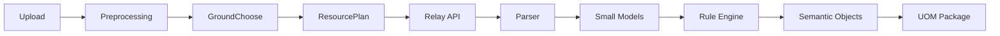

# Document Intelligence Demo UI

## Purpose

The Relay Demo is a local, single-page enterprise demonstration interface. It is served by the existing FastAPI application at `/demo` and contains no login, database, frontend build step, or duplicate Relay logic.

The page submits the selected PDF/DOCX and the option fields to the existing `POST /api/v1/relay/process` API. After the synchronous request returns an `execution_id`, it reads the existing execution, Ground, ResourcePlan, model, provenance, and UOM endpoints to render the result.

## Start

```bash
source .venv/bin/activate
uvicorn zyrelay.app.main:app --reload
```

Open <http://127.0.0.1:8000/demo>.

For a quick local sample, upload `examples/team_code_convention.docx` or `examples/team_code_convention_scanned.pdf`.

## What the page shows

1. **Upload panel** — drag/drop and file selector for PDF/DOCX; file name, type, size, and returned page count.
2. **Processing options** — enterprise, team, project, mode, OCR, output detail, Ground profile and optional layout-model switch. Values map directly to the Relay multipart request.
3. **Timeline** — immediate progress feedback while the request runs, then real `RelayExecution.steps` statuses and durations.
4. **Semantic object viewer** — groups UOM objects into entities, rules, relations, events and business objects.
5. **Evidence viewer** — selecting an object requests `/api/v1/relay/provenance/{id}` and displays page, block, offsets, source text, rule IDs, Ground snapshot, resource plugin, model, and provenance ID. Evidence is highlighted only when its offsets are valid for the returned text.
6. **Resource panel** — Ground profile, ResourcePlan, plugins/models, execution time, skipped models, and fallback information.
7. **UOM viewer** — collapsible MOM, SOM, BOM, Semantic Objects, Processing, Resources, Ground and Provenance sections. The package can be downloaded as JSON.

`output_detail=full` is the recommended setting for a demonstration because it returns a richer immediate Relay response. The UOM viewer itself reads the package persisted by Relay through the pre-existing document UOM endpoint.

## APIs used

```text
POST /api/v1/relay/process
GET  /api/v1/relay/executions/{execution_id}
GET  /api/v1/relay/executions/{execution_id}/ground
GET  /api/v1/relay/executions/{execution_id}/resources
GET  /api/v1/relay/executions/{execution_id}/models
GET  /api/v1/relay/provenance/{provenance_id}
GET  /api/v1/documents/{document_id}/uom
GET  /health
```

No Relay API is added or changed by the demo.

## Architecture



The visual page includes the same architecture flow and exposes the Mermaid source. The actual Relay pipeline remains rule-first; models contribute auxiliary metadata and fallback state only.

## Notes

- Relay processing is synchronous in the current MVP. The progress bar is an in-request visual indicator; the final timeline always uses persisted step records returned by Relay.
- When a model is unavailable, the ResourcePlan and model records show its skipped or fallback state. The demo does not hide those conditions.
- Semantic results without a provenance record can still be listed, but the evidence viewer will state that no detailed provenance was returned.
