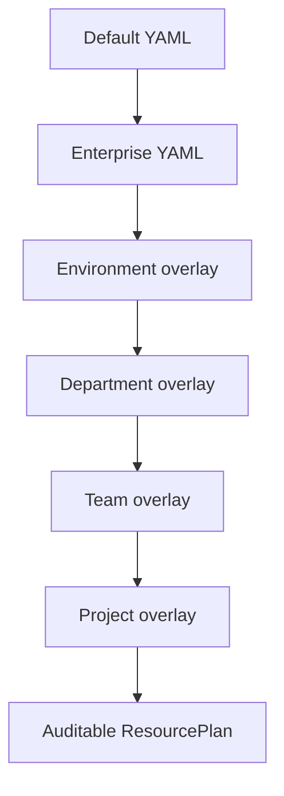

# Enterprise Resource Manager

Resource plans are deterministic YAML selections. The default resource profile
is merged with enterprise overrides, then applies scope overlays in this order:
environment, department, team, project. Supported environments are `dev`,
`test`, and `prod`.

Every ResourcePlan records resource/version, health, fallback, compatibility,
execution ID, latency and gate outcome. Unavailable optional models fall back to
the configured heuristic resource; rule extraction continues and a warning is
preserved.

